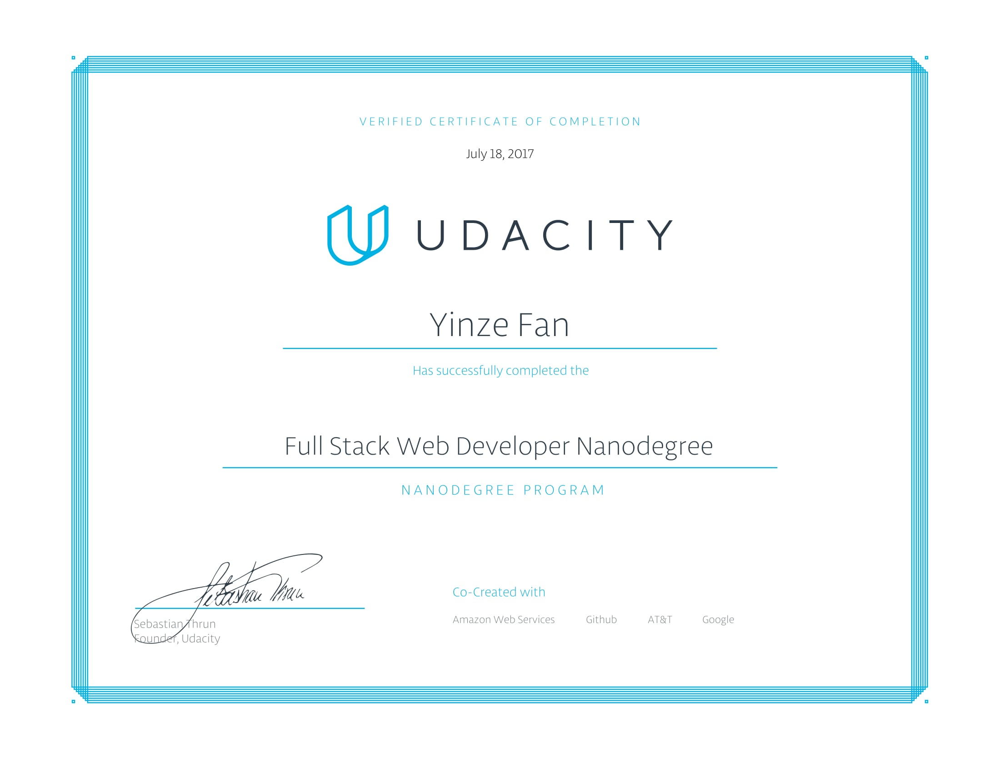

# Udacity Full Stack Web Developer Nanodegree

### About
This repository contains projects for Udacity's [Full Stack Web Developer Nanodegree](https://www.udacity.com/course/nd004) completed by July 2017

### Projects
- **p1** - [Movie Trailer Website](https://github.com/fyzalt/FSWD-Project-1-Movie-Trailer-Website.git)
- **p2** - [Personal Portfolio](https://github.com/fyzalt/FSWD-Project-2-Personal-Portfolio)
- **p3** - [Log Analysis](https://github.com/fyzalt/FSWD-Project-3-Logs-Analysis)
- **p4** - [Clash of Clan Building Catalog](https://github.com/fyzalt/FSWD-Project-4-Item-Catalog)
- **p5** - [Univerisity of Toronto Campus Study Area App](https://github.com/fyzalt/FSWD-Project-5-Neigborhood-Map)
- **p6** - [Linux-based Server Configuration](https://github.com/fyzalt/FSWD-Project-6-Linux-Server-Configuration)

### Courses
- Programming Foundations with Python
- Responsive Web Design Fundamentals
- Intro to HTML and CSS
- Responsive Images
- Intro to Relational Databases
- Authentication & Authorization: OAuth
- Full Stack Foundations
- Intro to AJAX
- JavaScript Design Patterns
- Configuring Linux Web Servers
- Linux Command Line Basics

### Nanodegree Certificate

